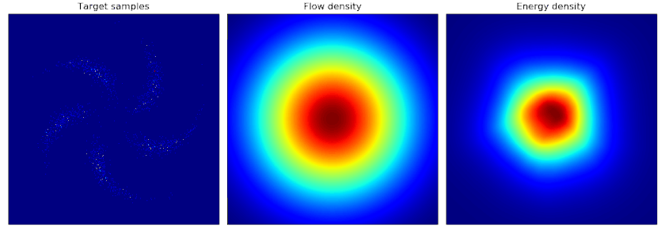
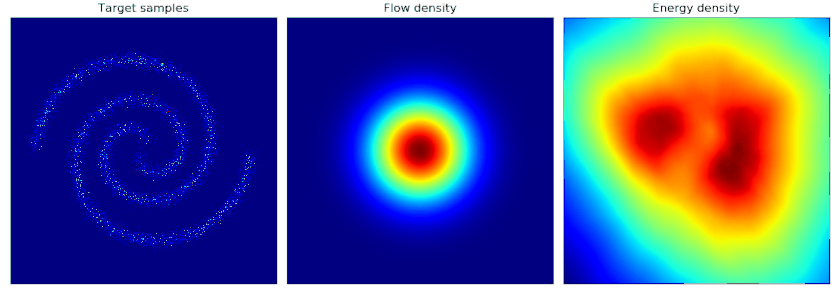

# Noise Contrastive Estimation (NCE)

### The Method

This is an implementation of  [Noise Contrastive Estimation (NCE)]( http://proceedings.mlr.press/v9/gutmann10a/gutmann10a.pdf ) on 2D dataset. 

NCE is a method to estimate energy based models (EBM)

<a href="https://www.codecogs.com/eqnedit.php?latex=p(x)&space;=&space;\frac{\exp[-f_\theta(x)]}{Z(\theta)}" target="_blank"></a>

where

<a href="https://www.codecogs.com/eqnedit.php?latex=Z(\theta)&space;=&space;\int\exp[-f_\theta(x)]dx" target="_blank"></a>

is the normalizing constant that is hard to compute. In NCE,  the normalizing constant is specified as a trainable parameter <a href="https://www.codecogs.com/eqnedit.php?latex=c=\log&space;Z" target="_blank"></a>. We cannot directly do MLE training on the dataset because <a href="https://www.codecogs.com/eqnedit.php?latex=p" target="_blank"></a> can simply blow up to infinity by letting  <a href="https://www.codecogs.com/eqnedit.php?latex=Z\to0" target="_blank"></a>(or <a href="https://www.codecogs.com/eqnedit.php?latex=c\to-\infty" target="_blank"></a>). Instead, in NCE, we train the EBM by doing a (nonlinear) logistic regression/classification between the training data and some noise. 

----

### Training

The training objective is specified in the file [util.py](util.py). To train the model, do

```shell
python trian.py --dataset=8gaussians # avaiable: '8gaussians', '2spirals', 'checkerboard', 'rings', 'pinwheel'
```

----

### Examples

Sample training processes:

- `8gaussians` dataset


- `pinwheel` dataset



- `2spirals` dataset

